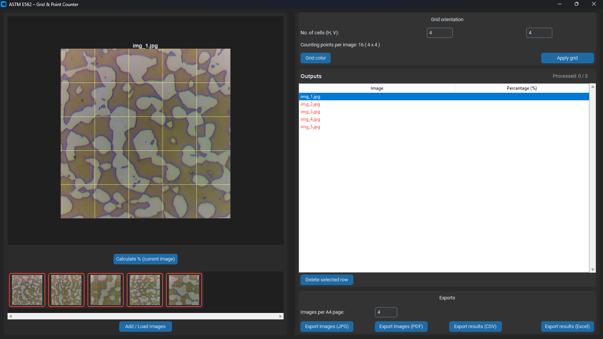
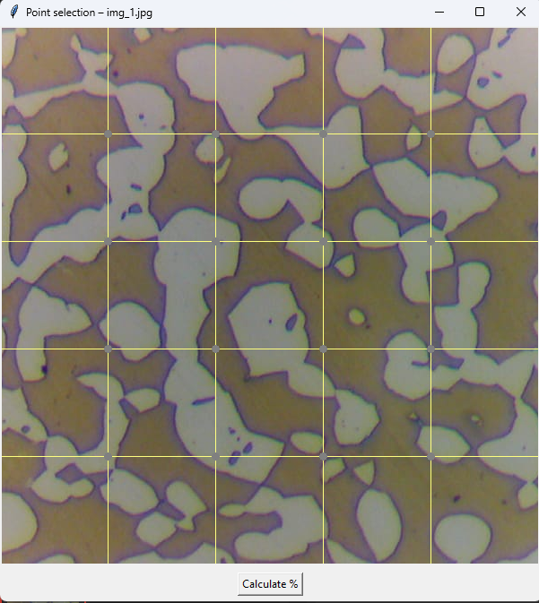

# 🧪 ASTM E-562 Manual Point Counting Application  
### **Python + OpenCV + CustomTkinter Desktop App (with .EXE installer)**

This project is a complete desktop application for performing **ASTM E-562 point counting** on microstructure images.  
It includes:

- Automatic grid overlay  
- Non-border interior intersection points  
- Manual phase classification (Inside = 1.0, Boundary = 0.5)  
- Real-time percentage calculation
- Intuitive progress tracking and clear image identification
- CSV / Excel export  
- A4 image export (JPG/PDF)  
- Windows EXE creation  
- Full Installer (Setup.exe)

---

## 📸 Screenshots

  
*Main Application Window with Image Preview and Thumbnails*

  
*Interactive Point Selection Grid*

---

## 📌 Features

### ✅ 1. Load multiple microstructure images  
Supports:  
`JPG, JPEG, PNG, TIFF, BMP`

---

### ✅ 2. Auto-crops images to perfect square  
Ensures grid stays uniform and equally sized.

---

### ✅ 3. Automatic grid generation  
User sets:

- **H cells (vertical divisions)**
- **V cells (horizontal divisions)**
- **Grid color**

---

### ✅ 4. Smart intersection point generation  
🎯 **Points are placed inside the grid, NOT on borders**  
Formula:

```
x = (col + 1) * (W / (cols + 1))
y = (row + 1) * (H / (rows + 1))
```

Produces perfect NxN interior points.

---

### ✅ 5. Automatic & Manual Classification  
You can perform point counting in two modes:

- **Auto Mode**: Select "Auto (Dark Phase)" or "Auto (Light Phase)". The application will automatically calculate the phase using Otsu's thresholding.
- **Manual Mode / Correction**: In any mode, click on an intersection point on the grid to classify or correct it:

| Type      | Value | Color   |
|-----------|--------|----------|
| Inside    | 1.0    | green    |
| Boundary  | 0.5    | orange   |
| Reset     | 0      | gray     |

---

### ✅ 6. Progress Tracking & Image Identification
- **Visual Status**: Image thumbnails display dynamic borders (🔴 Red for pending, 🟢 Green for processed) so you always know what's left.
- **Progress Label**: A tracker shows the overall processed ratio (e.g. `Processed: 4 / 30`).
- **Image Names**: The active image file name is prominently displayed under the preview window, in the selection popup title, and upon calculating the results to ensure clear identification.

---

### ✅ 7. Percentage Calculation  
Matches ASTM E-562:

```
Volume % = ( Σ(point values) / Total Points ) × 100
```

Displayed and saved in results table. The table rows are color-coded based on the calculation status.

---

### ✅ 8. Export Options  
You can export:

- **A4 JPG pages** (multiple images per page)  
- **A4 PDF pages**  
- **CSV results**  
- **Excel results (XLSX)**  

---

### ✅ 9. Full Windows App (.EXE)  
Built using:

```
pyinstaller --onefile --windowed astm_app.py
```

Runs on any Windows PC — no Python needed.

---

## 🚀 Installation (For Users)

### 1. Download the file  
`astm_e562_app.exe`

### 2. Launch the Application  
**astm_e562_app.exe**

---
## 📁 Project Structure

```
ASTM-E562-App/
│
├── astm_e652_app.py
├── astm_e652_app.exe            
├── README.md
├── sample_image                              
└── grid_settings.json     
```

---

## 🧩 Technologies Used
- Python  
- OpenCV  
- CustomTkinter  
- PIL (Pillow)  
- ReportLab  
- OpenPyXL  
- PyInstaller  

---


